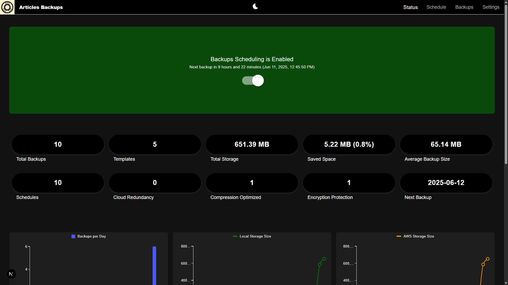

# 🗃️ Articles Backups

**Articles Backups** is an open-source web app built with **React.js**, **Next.js**, and **Node.js** that helps users securely back up and manage saved files and folders.

---

## 🚀 Features



- Backup, Compress, and Encrypt your files and folders
- Organize and search backups with favorites and metadata
- Export backups to cloud providers
- RESTful API for integration and automation

---

## 🔧 Tech Stack

- **Frontend:** React.js (via Next.js App Router)
- **Backend:** Node.js (via Next.js Route Handlers)
- **Database:** Local file system

---

## 🔮 Future Features

- ☁️ **Cloud Provider Integration**  
  Link your Google Drive, Dropbox, or AWS account to automatically upload backups once they're created.

- 🔄 **Scheduled Backups**  
  Set schedules for automatic backups.

- 🖥️ Electron Integration
Run Articles Backups as a standalone desktop app with a one-click setup.
This feature will bundle the backend, frontend, and configuration flow into a single   executable file for seamless local use and management.

- 💽 Linux Support
Plans to support Linux file systems.

---

## 👥 Looking to Contribute?

We welcome contributions from the community! Whether you want to fix a bug, add a feature, or improve the documentation:

1. Fork the repo
2. Create a new branch (`git checkout -b feature/some-feature`)
3. Commit your changes (`git commit -am 'Add some feature'`)
4. Push to the branch (`git push origin feature/some-feature`)
5. Open a pull request

Please read through our [Contributing Guide](CONTRIBUTING.md) for details on how to get started.

---

## 🛡️ Security

Security is a top priority. If you discover a vulnerability in this project:

- **Do not** open a public issue.
- Please responsibly disclose it by emailing [youremail@example.com] or submitting it via our [security disclosure form](#) (coming soon).
- We will respond as quickly as possible and coordinate a fix.

---

## 📚 About

Articles Backups was created by ArticlesJoey as a side project. It's purpose is to assist in backup creation and management. Written in JavaScript and Node.JS it offers a lightweight backup manager in a easily understandable way. This allows easier contribution and lower attack vectors.

Maintained by [ArticlesJoey](https://github.com/Articles-Joey) and open to contributions from the community.

---

## 📄 License

This project is licensed under the [MIT License](LICENSE).

---

## 🛠 Installation

### Prerequisites
- Node.js ≥ 22
- npm
- AWS CLI required for AWS S3 uploads

### Setup

```bash
git clone https://github.com/todo/articles-backups.git
cd articles-backups
npm install
npm run dev
